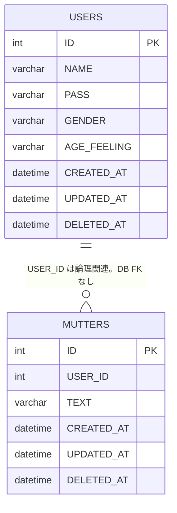

# Data and Security Design（データ・セキュリティ設計）

<!-- Document Info（文書情報） -->
| Item（項目） | Value（値） |
|---|---|
| Document ID（文書ID） | DATA-001 |
| Version（バージョン） | 1.9 |
| Status（ステータス） | Review |
| Created Date（作成日） | 2026-06-21 |
| Last Updated（最終更新日） | 2026-10-05 |
| Owner（管理者） | Takashi Oikawa |
| Related Documents（関連文書） | [Project README](../../README.md) / [README.md](./README.md) / [02_REQUIREMENTS_DEFINITION.md](./02_REQUIREMENTS_DEFINITION.md) / [05_ARCHITECTURE_DESIGN.md](./05_ARCHITECTURE_DESIGN.md) / [06_OPERATION_AND_HANDOFF.md](./06_OPERATION_AND_HANDOFF.md) / [API_SPEC.md](../specs/API_SPEC.md) / [GEMINI_INTEGRATION_SPEC.md](../specs/GEMINI_INTEGRATION_SPEC.md) |

---

## Table of Contents（目次）

1. [Purpose（目的）](#1-purpose目的)
2. [Scope（対象範囲）](#2-scope対象範囲)
3. [Out of Scope（対象外範囲）](#3-out-of-scope対象外範囲)
4. [Assumptions（前提条件）](#4-assumptions前提条件)
5. [Definition Details（定義内容）](#5-definition-details定義内容)
6. [Open Issues（未決事項）](#6-open-issues未決事項)
7. [Handoff to Detail Design（詳細設計への引き継ぎ）](#7-handoff-to-detail-design詳細設計への引き継ぎ)

---

## 1. Purpose（目的）

本文書は、Phase 1 のエンティティ、テーブル、認証・認可、秘密情報管理を定義し、実装の基準とする。

---

## 2. Scope（対象範囲）

- エンティティ: User / Mutter
- Schema: `dokotsubu`
- テーブル: `USERS` / `MUTTERS`
- 現行 DB 実体と Phase 1 Target Schema の分離
- データライフサイクル（`CREATED_AT` / `UPDATED_AT` / `DELETED_AT`）と論理削除
- User プロフィール（`GENDER` / `AGE_FEELING`）
- 認証（`HttpSession` / `loginUser`）
- 認可（編集・削除の投稿者本人限定）
- password の hash 保存
- Gemini API key および DB 接続情報の外部設定

---

## 3. Out of Scope（対象外範囲）

- Spring Security による認証基盤
- JPA / Hibernate / Spring Data
- 今回の Spring Boot 移行だけを理由とする table rename / schema rename / `TEXT` 長変更 / FK 追加
- ユーザー削除画面、ユーザー削除 Controller、ユーザー削除 API、ユーザー削除操作導線
- 「入会」「退会」というドメイン概念
- 秘密値の文書記載

---

## 4. Assumptions（前提条件）

- Development DB は現行ローカル MySQL である。2026-09-12 のライブ MySQL 実測で確認済みである。この実測は現行 DB 実体であり、Phase 1 Target Schema へ書き換えない
- Production DB は Aiven MySQL である。Schema は `dokotsubu`。Domain tables は `USERS` / `MUTTERS` である
- 移行完了後の Development / Production の Domain table 構造は、Phase 1 Target Schema で同一とする
- 2026-09-28 の Aiven 実接続スパイクで、当時の現行 DDL・JDBC・FR-001・FR-002 が変更なしで動作することを確認済みである。この結果は Target Schema 適用済みを意味しない
- Application 内部の Java 命名は通常の lower camel / class naming を用いてよい
- 現行 `DokoTsubu2` の DAO は `users` / `MUTTERS` / `USERS` の表記が混在する。DB アクセス対象の正は `USERS` / `MUTTERS` である
- Application は `BakaUpArea` を参照しない

---

## 5. Definition Details（定義内容）

現行ローカル MySQL 実体と Phase 1 Target Schema を分離して示す。現行実体の列を、既に Target Schema であるように書き換えない。Schema 名、table 名、`MUTTERS.TEXT` 長、FK なしは維持する。移行完了後の Development と Production の Domain table 構造は Target Schema で同一とする。

### 5.1 Current Data Model（現行データモデル）

#### 現行 DB 実体（2026-09-12 ライブ MySQL 実測）

| Item（項目） | Value（値） |
|---|---|
| Schema | `dokotsubu` |
| Tables | `USERS` / `MUTTERS` |
| `MUTTERS.TEXT` | `VARCHAR(255)` |
| FK | なし（`SHOW CREATE TABLE MUTTERS` で `USER_ID` に外部キー制約なし） |

#### Environment（環境別 DB）

移行完了後の Domain table 構造は Development と Production で同一とする。Host / Port / Username / Password 等の実値は記録しない。

| Environment（環境） | Database（DB） | Schema | Domain tables |
|---|---|---|---|
| Development（開発） | 現行ローカル MySQL | `dokotsubu` | `USERS` / `MUTTERS` |
| Production（本番） | Aiven MySQL | `dokotsubu` | `USERS` / `MUTTERS` |

#### Aiven 実接続スパイク（2026-09-28）

公開 DB として Aiven MySQL を正式採用する根拠は、次の確認済み結果である。確認時点の Application コードと domain DDL は変更していない。この表は 2026-09-28 時点の現行 DDL に対する結果であり、Phase 1 Target Schema が適用済みであることを意味しない。

| Item（項目） | Result（結果） |
|---|---|
| Aiven JDBC 接続 | PASS |
| 現行 `USERS` DDL | PASS |
| 現行 `MUTTERS` DDL | PASS |
| FR-001 登録 | PASS |
| BCrypt 保存 | PASS |
| FR-002 ログイン | PASS |
| 既存 UserDAO SQL | 変更不要 |

### 5.2 Target Data Model（目標データモデル）

#### Phase 1 Target Schema

Phase 1 Target Schema は現行実体とは別である。列定義は §5.3 の Target を正とする。

| Item（項目） | Value（値） |
|---|---|
| Schema | `dokotsubu` |
| Tables | `USERS` / `MUTTERS` |
| `MUTTERS.TEXT` | `VARCHAR(255)` |
| FK | 追加しない |
| password | `USERS.PASS VARCHAR(255)` に BCrypt hash を保存する |
| ライフサイクル | `USERS` / `MUTTERS` に `CREATED_AT` / `UPDATED_AT` / `DELETED_AT` |
| プロフィール | `USERS.GENDER` / `USERS.AGE_FEELING` |
| 論理削除 | 有効判定は `DELETED_AT IS NULL` |

#### Entity List（エンティティ一覧）

| Entity Name（エンティティ名） | Description（説明） |
|---|---|
| User | 登録利用者。永続化時の password は hash のみ。プロフィールとして `GENDER` / `AGE_FEELING` を持つ。セッションへは id と name だけを載せる。論理削除は `DELETED_AT` |
| Mutter | つぶやき。投稿者は `USER_ID` で User に関連する。論理削除は `DELETED_AT` |

#### ER Diagram（ER図）

Phase 1 Target Schema の列を示す。2026-09-12 実測の現行 DB 実体には、次の追加列はまだ無い。DB FK は追加しない。

関係: Application が `MUTTERS.USER_ID` と `USERS.ID` を論理的に関連付ける。DB FK は存在しない。

### 5.3 Table Definitions（テーブル定義）

現行 DB 実体と Phase 1 Target Schema を分けて示す。現行実体は 2026-09-12 ライブ MySQL 実測のままとする。

#### 現行 DB 実体: USERS（2026-09-12 実測）

| Column（カラム名） | Type（型） | NOT NULL | PK / FK | Description（説明） |
|---|---|---|---|---|
| ID | INT | YES | PK, AUTO_INCREMENT | ユーザー ID |
| NAME | VARCHAR(100) | YES | UNIQUE | ユーザー名 |
| PASS | VARCHAR(255) | YES | - | 実測時点の password 列。Phase 1 の保存方式は BCrypt hash |

#### 現行 DB 実体: MUTTERS（2026-09-12 実測）

| Column（カラム名） | Type（型） | NOT NULL | PK / FK | Description（説明） |
|---|---|---|---|---|
| ID | INT | YES | PK, AUTO_INCREMENT | つぶやき ID |
| USER_ID | INT | YES | - | 投稿者。DB FK 制約はない |
| TEXT | VARCHAR(255) | YES | - | つぶやき本文 |

#### Phase 1 Target Schema: USERS

| Column | Type | NULL | Constraint / Purpose |
|---|---|---|---|
| ID | INT | NO | PK / AUTO_INCREMENT |
| NAME | VARCHAR(100) | NO | UNIQUE。論理削除済み User の NAME も予約済みとし、再利用しない |
| PASS | VARCHAR(255) | NO | BCrypt hash |
| GENDER | VARCHAR(16) | NO | `MALE` / `FEMALE` / `OTHER` / `PRIVATE`。DB default は設けない |
| AGE_FEELING | VARCHAR(32) | NO | 定義済み 5 値。DB default は設けない |
| CREATED_AT | DATETIME | NO | 作成日時 |
| UPDATED_AT | DATETIME | NO | 最終更新日時 |
| DELETED_AT | DATETIME | YES | 論理削除日時。有効状態は NULL |

#### Phase 1 Target Schema: MUTTERS

| Column | Type | NULL | Constraint / Purpose |
|---|---|---|---|
| ID | INT | NO | PK / AUTO_INCREMENT |
| USER_ID | INT | NO | User との論理関連。今回 FK は追加しない |
| TEXT | VARCHAR(255) | NO | 投稿本文 |
| CREATED_AT | DATETIME | NO | 作成日時 |
| UPDATED_AT | DATETIME | NO | 最終更新日時 |
| DELETED_AT | DATETIME | YES | 論理削除日時。有効状態は NULL |

### 5.4 Data Lifecycle（データライフサイクル）

#### 日時管理

| Column | 設計仕様 |
|---|---|
| CREATED_AT | レコード作成時に設定する。通常更新では変更しない |
| UPDATED_AT | 作成時にも設定する。レコード内容更新時に更新する。論理削除時にも更新する |
| DELETED_AT | 有効状態は NULL。論理削除時に削除日時を設定する |

#### 論理削除と有効データ

- `USERS` / `MUTTERS` は論理削除とする
- 通常処理の有効判定は `DELETED_AT IS NULL` とする
- 通常の投稿削除は `MUTTERS.DELETED_AT` を設定する論理削除とし、物理 DELETE は実行しない

#### User 論理削除時の整合性

User を論理削除状態に変更する処理が実行される場合は、`USERS.DELETED_AT` を設定すると同時に、その `USER_ID` を持つ有効な `MUTTERS` も論理削除状態にする。この 2 処理は、データ整合性上、同一 DB トランザクションで扱う。

今回は次を作らない。

- ユーザー削除画面
- ユーザー削除 Controller
- ユーザー削除 API
- ユーザー削除操作導線

「入会」「退会」という概念は定義しない。

#### NAME UNIQUE

`USERS.NAME` の UNIQUE を維持する。論理削除済み User の `NAME` も予約済みとして扱い、再利用しない。

#### Schema 移行時のデータと password 移行方針

- Schema 移行時に、既存 `USERS` / `MUTTERS` の Domain データを初期化する
- 既存 User は移行後へ引き継がない
- 旧 password から BCrypt へのデータ移行は行わない
- 新規 User は登録時から BCrypt hash のみを保存する
- 平文 password 保存は禁止する
- 平文 password との互換認証は実装しない
- 運用手順の詳細は [06_OPERATION_AND_HANDOFF.md](./06_OPERATION_AND_HANDOFF.md) を正とする
- 実際のデータ初期化や Schema 変更は、この文書更新では実行しない

### 5.5 User Profile（ユーザープロフィール）

| Item（項目） | Design（設計） |
|---|---|
| 保持列 | `USERS.GENDER` / `USERS.AGE_FEELING`。どちらも NOT NULL |
| `GENDER` 画面初期値 | `PRIVATE`。Application は必ず正式な値を DB へ渡す |
| `AGE_FEELING` 画面初期値 | 初期選択なし。DB default は設けない |
| 値の意味 | [02_REQUIREMENTS_DEFINITION.md](./02_REQUIREMENTS_DEFINITION.md) を正とする |
| Session | `GENDER` / `AGE_FEELING` は Session へ保存しない |
| Gemini 利用 | §5.7 を正とする |

### 5.6 Authentication / Authorization（認証・認可）

#### Data Access and Role Design（データアクセス権限・ロール設計）

ロールモデルは設けない。ログイン済み利用者のみを扱う。

| Role Name（ロール名） | Accessible Data / Permitted Operations（アクセス可能なデータ / 操作範囲） |
|---|---|
| 未ログイン | 登録、ログイン入口、ログアウト処理 |
| ログイン済み利用者 | 一覧、投稿、検索。対象は `DELETED_AT IS NULL` の Mutter と User。編集・削除は `MUTTERS.USER_ID == loginUser.id` かつ両方が論理削除されていない自分の投稿のみ |

投稿者認可は DB FK の有無に依存させない。Application で `MUTTERS.USER_ID == loginUser.id` を検証する。

#### Authentication and Authorization Specifications（認証・認可仕様）

| Type（種別） | Design Specification（設計仕様） |
|---|---|
| Authentication（認証） | Application API は現行 `HttpSession` を維持する。キーは `loginUser`。保存内容は user id と user name のみ。`GENDER` / `AGE_FEELING` は Session へ保存しない。password は Session へ保存しない。ログイン対象は `USERS.DELETED_AT IS NULL` の User のみ。Vercel 公開時は instance-local Session へ依存しない。Vercel 公開用に、保存先を Spring Session JDBC + Aiven MySQL へ外部化する。Spring Session 用テーブルは domain table `USERS` / `MUTTERS` とは分ける。ログイン必須判定は Spring MVC の共通機構で一元化する。Spring Security の FilterChain 等は導入しない |
| Authorization（認可） | 編集・削除は「ログイン済み」かつ `MUTTERS.USER_ID == loginUser.id` かつ Mutter と User が論理削除されていない場合だけ許可する。ID だけを条件とする UPDATE / DELETE は禁止する。通常の投稿削除は `DELETED_AT` を設定する論理削除とし、物理 DELETE は実行しない。最終判定はサーバー側で行う。DB FK の有無には依存しない |
| Access Control（権限管理） | 画面は自分の投稿以外に編集・削除操作を表示しない。画面非表示は補助であり、認可の正ではない |

ログイン照合は、入力 password と保存済み BCrypt hash を比較する。Spring Security 認証機能全体は導入しない。ハッシュ照合に必要な最小利用は許可する。

### 5.7 Gemini Data Transfer（Gemini送信データ）

| Type（種別） | Data（データ） |
|---|---|
| 送信する | 投稿本文、`GENDER`、`AGE_FEELING` |
| 送信しない | `PASS`、ユーザー ID、ユーザー名、Session 情報、DB 接続情報、その他秘密情報 |

連携方式の詳細は [GEMINI_INTEGRATION_SPEC.md](../specs/GEMINI_INTEGRATION_SPEC.md) を参照。

### 5.8 Security Design（セキュリティ設計）

#### Personal and Confidential Data Policy（個人情報・機密データの取り扱い方針）

- 利用者名、password hash、プロフィール情報（`GENDER` / `AGE_FEELING`）を扱う
- password 平文、Gemini API key、DB password、その他秘密情報の実値を、Repository 全体の現行 Git 管理ファイルへ記載しない。部分マスク表記も残さない
- ローカル起動で秘密情報ファイルが必要な場合だけ `/Users/takashioikawa/Dev/dokoTsubu-platform/.local-secrets/` を使用し、Git 管理しない
- Vercel の秘密情報は Vercel Environment Variables に置く
- DB 設定名は `DOKOTSUBU_DB_URL` / `DOKOTSUBU_DB_USERNAME` / `DOKOTSUBU_DB_PASSWORD` を維持する。実値は source / Git / 文書へ記載しない
- Gemini API key の設定名は `DOKOTSUBU_GEMINI_API_KEY` とする。実値は source / Git / 文書 / ログへ記載しない
- Application から `BakaUpArea` を参照してはならない

#### Encryption, Masking, and Logging Policy（暗号化・マスキング・ログ取得方針）

| Type（種別） | Target（対象） | Policy / Method（方式・方針） |
|---|---|---|
| Encryption（暗号化） | USERS.PASS | 登録時に BCrypt で一方向ハッシュ化する。可逆暗号化は用いない |
| Masking（マスキング） | API key / DB password | Repository 全体の現行 Git 管理ファイルおよび文書に実値を書かない。部分マスク表記も残さない |
| Logging（ログ取得） | 秘密値 | ログへ API key / password / DB password を出さない。新規ログ基盤は Phase 1 対象外 |

#### Security Design Specifications（セキュリティ設計仕様）

| Type（種別） | Design Specification（設計仕様） |
|---|---|
| CSRF | Spring Security は導入しない。Session 保存型 CSRF token を Spring MVC Interceptor で照合する。token は既存 `HttpSession` に保存し、Spring Session JDBC 構成は維持する。パラメーター名は `csrfToken`。対象は `POST /Main`、`POST /UpdateMutter`、`POST /DeleteMutter`。各フォームは token を含む。token なしまたは Session token と不一致の場合は状態変更処理を実行せず 403 を返す |
| Communication（通信） | Gemini API は HTTPS REST。新規の通信暗号化要件は設けない |
| Data Storage（データ保存） | password は BCrypt hash のみ。Development DB は現行ローカル MySQL、Production DB は Aiven MySQL。Gemini API key と DB 接続情報は Spring 外部設定から取得する。ローカルは `.local-secrets/`、Vercel は Environment Variables。`/Users/takashioikawa/Dev/ai-config.json` への絶対パス依存は廃止する |
| Data Disposal（データ廃棄） | ログアウト時にセッションを破棄する。投稿削除は `MUTTERS.DELETED_AT` を設定する論理削除とする。通常処理の有効判定は `DELETED_AT IS NULL`。ユーザー削除機能は今回追加しない |
| Personal Data Protection（個人情報保護） | セッションと永続化に password 平文を残さない。秘密値を Git / source に置かない |

---

## 6. Open Issues（未決事項）

本文書では Open Issue を保持しない。

---

## 7. Handoff to Detail Design（詳細設計への引き継ぎ）

- DAO は JDBC を維持する。JPA / Spring Data へ置換しない
- Development DB は現行ローカル MySQL、Production DB は Aiven MySQL とする。Schema は `dokotsubu`、Domain tables は `USERS` / `MUTTERS`。現行 DB 実体と Phase 1 Target Schema は分離する。移行完了後の Domain table 構造は Target Schema で同一である
- Vercel 公開用に Session 保存先を Spring Session JDBC + Aiven MySQL へ外部化する。Spring Session 用テーブルは domain table とは分ける。ローカル MySQL で実装・確認済みである。本番の公開状態と確認範囲は [運用手順書](../DEPLOYMENT_AND_OPERATION_GUIDE.md) 第1節・6.1節を正とする。password は Session へ保存しない
- 更新・論理削除 SQL は必ず `ID` と `USER_ID` の両方を条件にする。通常の投稿削除は物理 DELETE ではなく `DELETED_AT` の設定とする
- 投稿者認可は `MUTTERS.USER_ID == loginUser.id` を Application で検証する。DB FK には依存しない
- Schema 移行時に、既存 `USERS` / `MUTTERS` の Domain データを初期化する。既存 User は移行後へ引き継がない。旧 password から BCrypt へのデータ移行は行わない。password は `PASS VARCHAR(255)` に BCrypt hash のみを保存し、新規 User は登録時から BCrypt hash のみを保存する。平文 password 保存は禁止する。平文 password との互換認証は実装しない。運用手順の詳細は [06_OPERATION_AND_HANDOFF.md](./06_OPERATION_AND_HANDOFF.md) を正とする。実際のデータ初期化や Schema 変更は、この文書更新では実行しない
- 承認済みの Schema 変更は、論理削除、`CREATED_AT` / `UPDATED_AT` / `DELETED_AT`、`GENDER`、`AGE_FEELING` に限る。table rename / schema rename / `TEXT` 長変更 / FK 追加は行わない
- User を論理削除する処理を将来実行する場合は、当該 User の有効な `MUTTERS` も同一トランザクションで論理削除する。ユーザー削除画面・Controller・API・操作導線は今回作らない
- 秘密値の実値を、Repository 全体の現行 Git 管理ファイルへ書かない。部分マスク表記も残さない
- `POST /Main`、`POST /UpdateMutter`、`POST /DeleteMutter` は Session 保存型 CSRF token を Spring MVC Interceptor で照合する。Spring Security は導入しない。不一致時は状態変更せず 403 を返す
