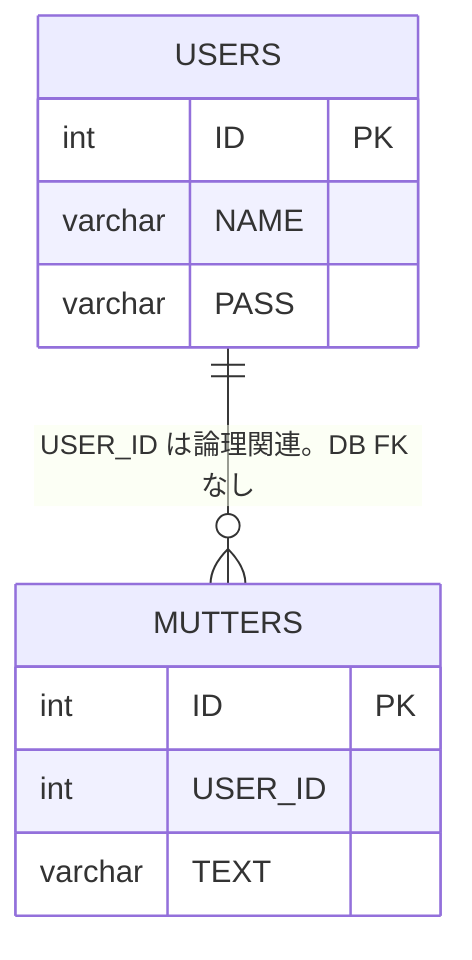

# Data and Security Design（データ・セキュリティ設計）

<!-- Document Info（文書情報） -->
| Item（項目） | Value（値） |
|---|---|
| Document ID（文書ID） | DATA-001 |
| Version（バージョン） | 1.5 |
| Status（ステータス） | Review |
| Created Date（作成日） | 2026-06-21 |
| Last Updated（最終更新日） | 2026-10-04 |
| Owner（管理者） | Takashi Oikawa |
| Related Documents（関連文書） | README.md / 02_REQUIREMENTS_DEFINITION.md / 05_ARCHITECTURE_DESIGN.md |

---

## Table of Contents（目次）

1. [Purpose（目的）](#1-purpose目的)
2. [Scope（対象範囲）](#2-scope対象範囲)
3. [Out of Scope（対象外範囲）](#3-out-of-scope対象外範囲)
4. [Assumptions（前提条件）](#4-assumptions前提条件)
5. [Definition Details（定義内容）](#5-definition-details定義内容)
6. [Open Issues（未決事項）](#6-open-issues未決事項)
7. [Handoff to Detail Design（詳細設計への引き継ぎ）](#7-handoff-to-detail-design詳細設計への引き継ぎ)

---

## 1. Purpose（目的）

本文書は、Phase 1 のエンティティ、テーブル、認証・認可、秘密情報管理を定義し、実装の基準とする。

---

## 2. Scope（対象範囲）

- エンティティ: User / Mutter
- Schema: `dokotsubu`
- テーブル: `USERS` / `MUTTERS`
- 認証（`HttpSession` / `loginUser`）
- 認可（編集・削除の投稿者本人限定）
- password の hash 保存
- Gemini API key および DB 接続情報の外部設定

---

## 3. Out of Scope（対象外範囲）

- Spring Security による認証基盤
- JPA / Hibernate / Spring Data
- 今回の Spring Boot 移行だけを理由とする table rename / schema rename / `TEXT` 長変更 / FK 追加
- 秘密値の文書記載

---

## 4. Assumptions（前提条件）

- Development DB は現行ローカル MySQL である。2026-09-12 のライブ MySQL 実測で確認済みである
- Production DB は Aiven MySQL である。Schema は `dokotsubu`。Domain tables は `USERS` / `MUTTERS`。構造は現行ローカル MySQL と同一である
- 2026-09-28 の Aiven 実接続スパイクで、現行 DDL・JDBC・FR-001・FR-002 が変更なしで動作することを確認済みである
- Application 内部の Java 命名は通常の lower camel / class naming を用いてよい
- 現行 `DokoTsubu2` の DAO は `users` / `MUTTERS` / `USERS` の表記が混在する。DB アクセス対象の正は `USERS` / `MUTTERS` である
- Application は `BakaUpArea` を参照しない

---

## 5. Definition Details（定義内容）

### 5.1 Entity Definition and ER Diagram（エンティティ定義・ER図）

現行ローカル MySQL 実体と Phase 1 target を分離して示す。Development と Production の Schema / table / `TEXT` 長 / FK 有無は一致する。

#### 現行 DB 実体（2026-09-12 ライブ MySQL 実測）

| Item（項目） | Value（値） |
|---|---|
| Schema | `dokotsubu` |
| Tables | `USERS` / `MUTTERS` |
| `MUTTERS.TEXT` | `VARCHAR(255)` |
| FK | なし（`SHOW CREATE TABLE MUTTERS` で `USER_ID` に外部キー制約なし） |

#### Phase 1 target

Phase 1 の DB アクセス対象は現行実体へ合わせる。

| Item（項目） | Value（値） |
|---|---|
| Schema | `dokotsubu` |
| Tables | `USERS` / `MUTTERS` |
| `MUTTERS.TEXT` | `VARCHAR(255)` |
| FK | 追加しない |
| password | `USERS.PASS VARCHAR(255)` に BCrypt hash を保存する |

#### Environment（環境別 DB）

Domain table 構造は Development と Production で同一とする。Host / Port / Username / Password 等の実値は記録しない。

| Environment（環境） | Database（DB） | Schema | Domain tables |
|---|---|---|---|
| Development（開発） | 現行ローカル MySQL | `dokotsubu` | `USERS` / `MUTTERS` |
| Production（本番） | Aiven MySQL | `dokotsubu` | `USERS` / `MUTTERS` |

#### Aiven 実接続スパイク（2026-09-28）

公開 DB として Aiven MySQL を正式採用する根拠は、次の確認済み結果である。Application コードと domain DDL は変更していない。

| Item（項目） | Result（結果） |
|---|---|
| Aiven JDBC 接続 | PASS |
| 現行 `USERS` DDL | PASS |
| 現行 `MUTTERS` DDL | PASS |
| FR-001 登録 | PASS |
| BCrypt 保存 | PASS |
| FR-002 ログイン | PASS |
| 既存 UserDAO SQL | 変更不要 |

#### Entity List（エンティティ一覧）

| Entity Name（エンティティ名） | Description（説明） |
|---|---|
| User | 登録利用者。永続化時の password は hash のみ。セッションへは id と name だけを載せる |
| Mutter | つぶやき。投稿者は `USER_ID` で User に関連する |

#### ER Diagram（ER図）

関係: Application が `MUTTERS.USER_ID` と `USERS.ID` を論理的に関連付ける。DB FK は存在しない。

### 5.2 Table Definitions（テーブル定義）

2026-09-12 ライブ MySQL 実測に基づく。Phase 1 の DB アクセス対象も同一である。

#### USERS

| Column（カラム名） | Type（型） | NOT NULL | PK / FK | Description（説明） |
|---|---|---|---|---|
| ID | INT | YES | PK, AUTO_INCREMENT | ユーザー ID |
| NAME | VARCHAR(100) | YES | UNIQUE | ユーザー名 |
| PASS | VARCHAR(255) | YES | - | Phase 1 target は BCrypt hash のみを保存する。平文は保存しない |

#### MUTTERS

| Column（カラム名） | Type（型） | NOT NULL | PK / FK | Description（説明） |
|---|---|---|---|---|
| ID | INT | YES | PK, AUTO_INCREMENT | つぶやき ID |
| USER_ID | INT | YES | - | 投稿者。DB FK 制約はない |
| TEXT | VARCHAR(255) | YES | - | つぶやき本文 |

### 5.3 Data Access and Role Design（データアクセス権限・ロール設計）

ロールモデルは設けない。ログイン済み利用者のみを扱う。

| Role Name（ロール名） | Accessible Data / Permitted Operations（アクセス可能なデータ / 操作範囲） |
|---|---|
| 未ログイン | 登録、ログイン入口、ログアウト処理 |
| ログイン済み利用者 | 一覧、投稿、検索。編集・削除は `MUTTERS.USER_ID == loginUser.id` の自分の投稿のみ |

投稿者認可は DB FK の有無に依存させない。Application で `MUTTERS.USER_ID == loginUser.id` を検証する。

### 5.4 Personal and Confidential Data Policy（個人情報・機密データの取り扱い方針）

- 利用者名と password hash を扱う
- password 平文、Gemini API key、DB password、その他秘密情報を source および Git 管理ファイルへ実値記載しない
- ローカル起動で秘密情報ファイルが必要な場合だけ `/Users/takashioikawa/Dev/dokoTsubu-platform/.local-secrets/` を使用し、Git 管理しない
- Vercel の秘密情報は Vercel Environment Variables に置く
- DB 設定名は `DOKOTSUBU_DB_URL` / `DOKOTSUBU_DB_USERNAME` / `DOKOTSUBU_DB_PASSWORD` を維持する。実値は source / Git / 文書へ記載しない
- Gemini API key の設定名は `DOKOTSUBU_GEMINI_API_KEY` とする。実値は source / Git / 文書 / ログへ記載しない
- Application から `BakaUpArea` を参照してはならない

### 5.5 Encryption, Masking, and Logging Policy（暗号化・マスキング・ログ取得方針）

| Type（種別） | Target（対象） | Policy / Method（方式・方針） |
|---|---|---|
| Encryption（暗号化） | USERS.PASS | 登録時に BCrypt で一方向ハッシュ化する。可逆暗号化は用いない |
| Masking（マスキング） | API key / DB password | 文書・source・Git に実値を書かない |
| Logging（ログ取得） | 秘密値 | ログへ API key / password / DB password を出さない。新規ログ基盤は Phase 1 対象外 |

### 5.6 Security Design Specifications（セキュリティ設計仕様）

| Type（種別） | Design Specification（設計仕様） |
|---|---|
| Authentication（認証） | Application API は現行 `HttpSession` を維持する。キーは `loginUser`。保存内容は user id と user name のみ。password は Session へ保存しない。Vercel 公開時は instance-local Session へ依存しない。Vercel 公開用に、保存先を Spring Session JDBC + Aiven MySQL へ外部化する。Spring Session 用テーブルは domain table `USERS` / `MUTTERS` とは分ける。Spring Session JDBC はローカル MySQL で実装・確認済みである。Aiven MySQL を接続先とする Vercel 本番デプロイは Ready で、ログイン画面表示と存在しないユーザーのログイン失敗画面を確認済みである。ただし、正しいログインと複数インスタンス間の Session 維持は本番未確認である。ログイン必須判定は Spring MVC の共通機構で一元化する。Spring Security の FilterChain 等は導入しない |
| Authorization（認可） | 編集・削除は「ログイン済み」かつ `MUTTERS.USER_ID == loginUser.id` の両方を満たす場合だけ許可する。ID だけを条件とする UPDATE / DELETE は禁止する。最終判定はサーバー側で行う。DB FK の有無には依存しない |
| Access Control（権限管理） | 画面は自分の投稿以外に編集・削除操作を表示しない。画面非表示は補助であり、認可の正ではない |
| Communication（通信） | Gemini API は HTTPS REST。新規の通信暗号化要件は設けない |
| Data Storage（データ保存） | password は BCrypt hash のみ。Development DB は現行ローカル MySQL、Production DB は Aiven MySQL。Gemini API key と DB 接続情報は Spring 外部設定から取得する。ローカルは `.local-secrets/`、Vercel は Environment Variables。`/Users/takashioikawa/Dev/ai-config.json` への絶対パス依存は廃止する |
| Data Disposal（データ廃棄） | ログアウト時にセッションを破棄する。追加の廃棄プロセスは Phase 1 対象外 |
| Personal Data Protection（個人情報保護） | セッションと永続化に password 平文を残さない。秘密値を Git / source に置かない |

ログイン照合は、入力 password と保存済み BCrypt hash を比較する。Spring Security 認証機能全体は導入しない。ハッシュ照合に必要な最小利用は許可する。

password 移行方針:

- Phase 1 では既存ユーザーを維持する
- Spring Boot 切替前に、既存の平文 password を BCrypt hash へ一度だけ移行する
- 移行後は平文 password を保存・比較しない
- Application に平文 / BCrypt の恒久的な二重認証ロジックを持たせない
- 実 DB への password 更新は今回実施しない
- 実際の移行実行時は、対象・影響・復旧手段を確認してから実施する

---

## 6. Open Issues（未決事項）

本文書では Open Issue を保持しない。

---

## 7. Handoff to Detail Design（詳細設計への引き継ぎ）

- DAO は JDBC を維持する。JPA / Spring Data へ置換しない
- Development DB は現行ローカル MySQL、Production DB は Aiven MySQL とする。Schema は `dokotsubu`、Domain tables は `USERS` / `MUTTERS`。構造は同一である
- Vercel 公開用に Session 保存先を Spring Session JDBC + Aiven MySQL へ外部化する。Spring Session 用テーブルは domain table とは分ける。ローカル MySQL で実装・確認済みである。Aiven MySQL を接続先とする Vercel 本番デプロイは Ready で、ログイン画面表示と存在しないユーザーのログイン失敗画面を確認済みである。ただし、正しいログインと複数インスタンス間の Session 維持は本番未確認である。password は Session へ保存しない
- 更新・削除 SQL は必ず `ID` と `USER_ID` の両方を条件にする
- 投稿者認可は `MUTTERS.USER_ID == loginUser.id` を Application で検証する。DB FK には依存しない
- password は `PASS VARCHAR(255)` に BCrypt hash を保存する。既存ユーザーは維持し、Spring Boot 切替前に平文を BCrypt へ一度だけ移行する。Application に平文 / BCrypt の恒久的な二重認証ロジックを持たせない。実 DB への password 更新は今回実施しない
- table rename / schema rename / `TEXT` 長変更 / FK 追加は、今回の Spring Boot 移行に含めない
- 秘密値の実値を設計書・実装・Git に書かない
