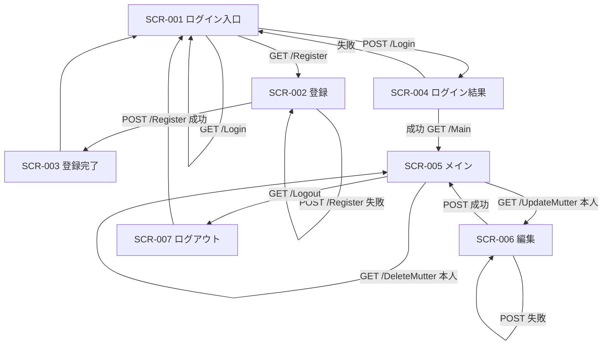

# UI and Flow Design（UI・フロー設計）

<!-- Document Info（文書情報） -->
| Item（項目） | Value（値） |
|---|---|
| Document ID（文書ID） | UI-001 |
| Version（バージョン） | 1.1 |
| Status（ステータス） | Approved |
| Created Date（作成日） | 2026-06-21 |
| Last Updated（最終更新日） | 2026-09-12 |
| Owner（管理者） | Takashi Oikawa |
| Related Documents（関連文書） | README.md / 02_REQUIREMENTS_DEFINITION.md / 05_ARCHITECTURE_DESIGN.md |

---

## Table of Contents（目次）

1. [Purpose（目的）](#1-purpose目的)
2. [Scope（対象範囲）](#2-scope対象範囲)
3. [Out of Scope（対象外範囲）](#3-out-of-scope対象外範囲)
4. [Assumptions（前提条件）](#4-assumptions前提条件)
5. [Definition Details（定義内容）](#5-definition-details定義内容)
6. [Open Issues（未決事項）](#6-open-issues未決事項)
7. [Handoff to Detail Design（詳細設計への引き継ぎ）](#7-handoff-to-detail-design詳細設計への引き継ぎ)

---

## 1. Purpose（目的）

本文書は、Phase 1 の画面構成・遷移・操作を定義する。遷移の正は現行 `DokoTsubu2` 実装事実と確定設計である。Legacy API 文書の誤記は引き継がない。

---

## 2. Scope（対象範囲）

現行 JSP 画面を Spring MVC + JSP へ移す範囲。

- ログイン入口、登録、登録完了、ログイン結果
- メイン（一覧・投稿・検索・Gemini 一言）
- 編集、ログアウト

---

## 3. Out of Scope（対象外範囲）

- Thymeleaf への置換
- 新規画面追加
- スクリーンショットの新規作成
- 新たなアクセシビリティ / レスポンシブ基準の追加

---

## 4. Assumptions（前提条件）

- View は JSP を維持する
- URL 生成は Spring MVC および JSP の context-aware な手段を使う
- Controller / JSP に `/dokoTsubu` を固定文字列として書かない
- 存在しないスクリーンショットは参照しない

---

## 5. Definition Details（定義内容）

### 5.1 Screen List — Detail Definition（画面一覧・詳細定義）

現行 JSP を Phase 1 の画面正とする。

| Screen ID（画面ID） | Screen Name（画面名） | Input Items（入力項目） | Output Items（出力項目） | Main Operations（主要操作） | Notes（備考） |
|---|---|---|---|---|---|
| SCR-001 | ログイン入口（現行 `index.jsp`） | `name`, `pass` | アプリ名、ログインフォーム、登録導線 | `POST /Login`、`GET /Register` | 未ログイン入口 |
| SCR-002 | ユーザー登録（現行 `registerView.jsp`） | `username`, `password` | エラーメッセージ | `POST /Register` | 認証不要 |
| SCR-003 | ユーザー登録完了（現行 `registerResult.jsp`） | なし | 完了メッセージ | 入口へ戻る | リンクは context-aware とする |
| SCR-004 | ログイン結果（現行 `loginResult.jsp`） | なし | 成功時はユーザー名、失敗時はエラー | 成功時は `GET /Main`、失敗時は入口へ | `loginUser` の有無で分岐 |
| SCR-005 | メイン（現行 `main.jsp`） | 投稿 `text`、検索 `keyword` | 一覧、エラー、`aiMsg` | 投稿、検索、更新、ログアウト、自分の投稿の編集・削除 | Gemini 一言は投稿直後のみ |
| SCR-006 | つぶやき編集（現行 `updateMutter.jsp`） | hidden `id`、`text` | エラー、入力値 | `POST /UpdateMutter`、一覧へ戻る | 失敗時は本画面へ戻る |
| SCR-007 | ログアウト（現行 `logout.jsp`） | なし | 完了メッセージ | 入口へ戻る | セッション破棄後 |

Phase 1 で現行から変える表示:

- 編集・削除操作は自分の投稿にだけ表示する
- 最終認可はサーバー側で行う

### 5.2 Screen Transition and Business Flow（画面遷移図・業務フロー）

実装で確認した遷移を正とする。次を必ず含める。

- `GET /Login` は存在する。ログイン入口（SCR-001）へ戻す
- 更新失敗時は一覧へ飛ばさず、編集画面（SCR-006）へ戻す
- 投稿成功時は SCR-005 に `aiMsg` を載せる

ログイン必須の入口:

- `/Main`
- `/SearchMutter`
- `/UpdateMutter`
- `/DeleteMutter`

未ログイン時はログイン入口へ誘導する。判定は Spring MVC の共通機構で行う。

### 5.3 Wireframes and Layout Policy（主要画面のワイヤーフレーム・レイアウト方針）

本文書では対象外。理由: 現行 JSP レイアウトを維持する。承認済みスクリーンショットは存在しないため、画像は掲載しない。

### 5.4 Operation Flow and User Scenarios（操作フロー・ユーザーシナリオ）

| Scenario ID（シナリオID） | Operation Name（操作名） | Steps（操作手順） |
|---|---|---|
| SC-001 | 登録 | 1. SCR-001 から登録へ → 2. `username` / `password` を送信 → 3. 成功なら SCR-003 |
| SC-002 | ログイン | 1. SCR-001 で `name` / `pass` を送信 → 2. SCR-004 → 3. 成功なら SCR-005 |
| SC-003 | 投稿と Gemini | 1. SCR-005 で `text` を送信 → 2. 保存後に Gemini を同期呼び出し → 3. 同一画面に一覧と `aiMsg` を表示。Gemini 失敗でも投稿は残る |
| SC-004 | 検索 | 1. SCR-005 で `keyword` を送信 → 2. `LIKE` 結果を同一画面に表示 |
| SC-005 | 編集 | 1. 自分の投稿の編集を開く → 2. `text` を送信 → 3. 成功なら SCR-005、失敗なら SCR-006 |
| SC-006 | 削除 | 1. 自分の投稿の削除を実行 → 2. SCR-005 へ戻る |
| SC-007 | ログアウト | 1. SCR-005 からログアウト → 2. セッション破棄 → 3. SCR-007 |

他人の投稿には編集・削除操作を出さない。URL 直叩きでもサーバー側で拒否する。

### 5.5 Validation and Error Handling Policy（バリデーション・エラーハンドリング方針 / UI層）

| Target（対象） | Validation Rules（バリデーションルール） | Error Message / Display Policy（エラーメッセージ・表示方針） |
|---|---|---|
| 登録 | `username` / `password` 必須 | 未入力・重複・その他エラーは SCR-002 に表示。現行メッセージを維持する |
| ログイン | `name` / `pass` 必須 | 未入力・認証失敗は SCR-004 に表示。現行メッセージを維持する |
| 投稿 | `text` 必須 | 未入力は SCR-005 に表示。現行メッセージを維持する |
| 編集 | `id` / `text` 必須。本人のみ | 失敗時は SCR-006 に戻し、入力を保持する。現行失敗メッセージを維持する。新規の他人操作メッセージは設けない。拒否時は更新せず一覧へ戻す |
| Gemini | 投稿成功後に呼び出す | 失敗文も `aiMsg` として SCR-005 に表示する |

### 5.6 Accessibility and Responsive Design Policy（アクセシビリティ・レスポンシブ対応方針）

本文書では対象外。理由: Phase 1 は現行 JSP の表示を維持し、新たな基準を追加しない。

---

## 6. Open Issues（未決事項）

本文書では対象外。理由: 画面遷移の確定事項は本文に記載済み。

---

## 7. Handoff to Detail Design（詳細設計への引き継ぎ）

- Legacy API 文書の「Update 成功失敗とも `/Main`」「`GET /Login` 無し」「Gemini 無し」は実装しない
- 自分の投稿以外に編集・削除 UI を出さない
- context path 文字列を JSP に直書きしない
