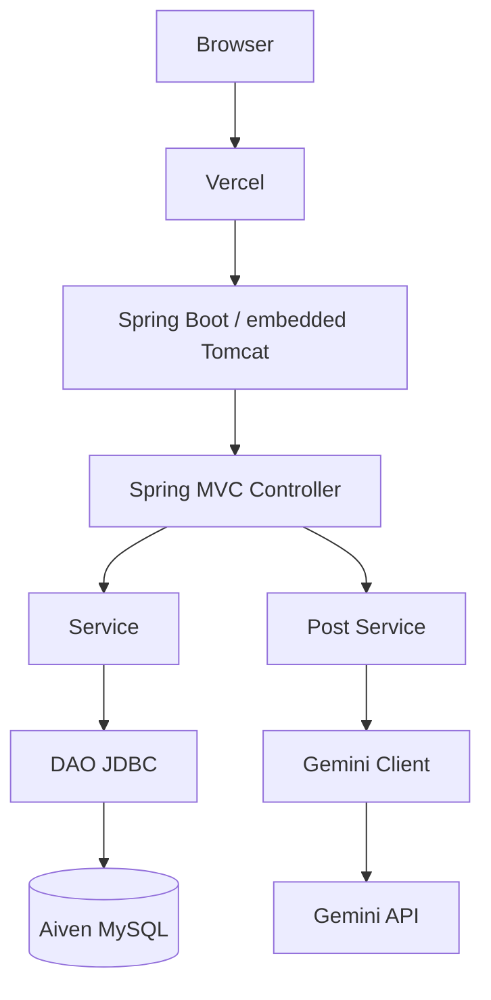

# Architecture Design（アーキテクチャ設計）

<!-- Document Info（文書情報） -->
| Item（項目） | Value（値） |
|---|---|
| Document ID（文書ID） | ARCH-001 |
| Version（バージョン） | 1.4 |
| Status（ステータス） | Approved |
| Created Date（作成日） | 2026-06-21 |
| Last Updated（最終更新日） | 2026-09-29 |
| Owner（管理者） | Takashi Oikawa |
| Related Documents（関連文書） | README.md / 02_REQUIREMENTS_DEFINITION.md / 03_DATA_AND_SECURITY_DESIGN.md / 06_OPERATION_AND_HANDOFF.md |

---

## Table of Contents（目次）

1. [Purpose（目的）](#1-purpose目的)
2. [Scope（対象範囲）](#2-scope対象範囲)
3. [Out of Scope（対象外範囲）](#3-out-of-scope対象外範囲)
4. [Assumptions（前提条件）](#4-assumptions前提条件)
5. [Definition Details（定義内容）](#5-definition-details定義内容)
6. [Open Issues（未決事項）](#6-open-issues未決事項)
7. [Handoff to Detail Design（詳細設計への引き継ぎ）](#7-handoff-to-detail-design詳細設計への引き継ぎ)

---

## 1. Purpose（目的）

本文書は、Phase 1 のシステム構造、技術方針、外部連携を定義し、実装の基準とする。

---

## 2. Scope（対象範囲）

- Servlet から Spring MVC Controller への移行
- 現行 Logic 責務の Service 化
- JDBC DAO と JSP の維持
- Gemini API 連携
- WAR packaging と embedded Tomcat
- Spring 外部設定への秘密情報移設

---

## 3. Out of Scope（対象外範囲）

Phase 1 対象外として次を導入しない。

- Spring Security による認証基盤
- JPA / Hibernate
- Spring Data
- Thymeleaf
- 外部 Tomcat 必須構成
- `/Users/takashioikawa/Dev/ai-config.json` への絶対パス依存

---

## 4. Assumptions（前提条件）

- `DokoTsubu2/` は現行 Servlet / JSP / JDBC 版として保持する。機能・挙動の比較基準とする
- Phase 1 の実装先は新規 `DokoTsubu3/`。`DokoTsubu2/` を Spring Boot プロジェクトへ直接変換しない
- `DokoTsubu3/` は独立した Maven Application とする
- 機能の基準は現行 `DokoTsubu2` 実装事実である
- context path は `/dokoTsubu` とするが、コードへ固定文字列として書かない
- Development DB は現行ローカル MySQL である。2026-09-12 実測で Schema は `dokotsubu`、Tables は `USERS` / `MUTTERS` である
- Production DB は Aiven MySQL である。Domain table 構造は現行ローカル MySQL と同一とし、不要な schema migration を行わない
- 公開先は Vercel である。Project Root は `DokoTsubu3`。Cloud Run は採用しない

---

## 5. Definition Details（定義内容）

### 5.1 System Architecture Diagram（システム構成図）

```text
Browser
  ↓
Vercel
  ↓
Spring Boot / embedded Tomcat
  Controller → Service → DAO (JDBC)
  ↓
Aiven MySQL

Post Service
  ↓
Gemini Client
  ↓
Gemini API
```



現行 Servlet 対応:

| 現行 Servlet | Phase 1 | URL |
|---|---|---|
| `servlet.Register` | Controller | `/Register` |
| `servlet.Login` | Controller | `/Login` |
| `servlet.Logout` | Controller | `/Logout` |
| `servlet.Main` | Controller | `/Main` |
| `servlet.SearchMutter` | Controller | `/SearchMutter` |
| `servlet.UpdateMutter` | Controller | `/UpdateMutter` |
| `servlet.DeleteMutter` | Controller | `/DeleteMutter` |

現行 `*Logic` の責務は Service へ移す。DAO は JDBC を維持する。

ログイン必須判定は Controller に複製せず、Spring MVC の共通機構で一元化する。

### 5.2 Technology Stack and Rationale（技術スタック・採用理由）

| Type（種別） | Technology（採用技術） | Version（バージョン） | Rationale（採用理由） |
|---|---|---|---|
| Language（言語） | Java | 21 | 現行 `DokoTsubu2` の言語水準を維持する |
| Framework（フレームワーク） | Spring Boot / Spring MVC | 4.1.1 | 確定方針。JSP を維持するため WAR とする |
| Build Tool | Maven | - | Phase 1 のビルド手段 |
| Packaging | WAR | - | JSP を維持する |
| View | JSP | 現行 JSP を移行 | Thymeleaf は対象外 |
| Persistence | JDBC | - | Spring Data / JPA は使用しない |
| Development Database（開発DB） | 現行ローカル MySQL | 9.6.0（2026-09-12 ローカル実測） | ローカル開発で使用してよい |
| Production Database（公開DB） | Aiven MySQL | - | 公開 DB。Schema `dokotsubu`。Domain tables は現行と同一 |
| Deployment（公開先） | Vercel | - | Project Root は `DokoTsubu3`。`Dockerfile.vercel` を使用する。Cloud Run は採用しない |
| Session Persistence（セッション保存） | Spring Session JDBC | Vercel 公開前に実装 | Application API は `HttpSession` を維持する。保存先は Aiven MySQL。domain table とは別。現時点では未実装 |
| Runtime | embedded Tomcat（Spring Boot 管理） | 11.0.x | 外部 Tomcat 必須にはしない。Spring Boot / JSP / JDBC / WAR は維持する |
| External API | Gemini API | model `gemini-3.5-flash-lite` | 現行連携を維持する |
| Other（その他） | BCrypt | - | password hash のみ。Spring Security 認証基盤は導入しない |

### 5.3 Module Structure and Layer Design（モジュール構成・レイヤー設計）

```text
dokoTsubu-platform/
├── DokoTsubu2/   現行 Servlet / JSP / JDBC 版
└── DokoTsubu3/   Phase 1 Spring Boot / Spring MVC / JSP / JDBC 版
```

- Phase 1 の実装先は `DokoTsubu3/`
- `DokoTsubu2/` は機能・挙動の比較基準として保持する
- `DokoTsubu2/` を Spring Boot プロジェクトへ直接変換しない
- `DokoTsubu3/` は独立した Maven Application とする
- Controller → Service → DAO(JDBC) → MySQL の既存確定 Architecture は変更しない。Production の MySQL は Aiven MySQL、Development は現行ローカル MySQL とする
- JSP、WAR、embedded Tomcat 等の確定技術構成も変更しない
- Presentation: Spring MVC Controller + JSP
- Application: Service（現行 Logic の責務）
- Persistence: DAO（JDBC）
- External: Gemini Client（投稿成功後に Post Service から同期呼び出し）

固定絶対パス JSON 設定は廃止し、Spring external configuration へ移す。

### 5.4 External Integration and API Design（外部システム連携・API設計方針）

| Integration Target / API Name（連携先 / API名） | Method（連携方式） | Purpose / Overview（用途・概要） |
|---|---|---|
| Gemini generateContent | HTTPS REST 同期呼び出し | 投稿成功後の短文コメント。model は `gemini-3.5-flash-lite`。`temperature` / `top_p` / `top_k` は明示指定しない。失敗しても投稿は rollback しない |
| Aiven MySQL（Production） / 現行ローカル MySQL（Development） | JDBC | Schema `dokotsubu` の domain tables `USERS` / `MUTTERS` への永続化。構造は同一。不要な schema migration は行わない |

Gemini API key は Spring 外部設定 `DOKOTSUBU_GEMINI_API_KEY` から取得する。ソースおよび Git 管理ファイルへ実値を書かない。

アプリケーションエンドポイントは [02_REQUIREMENTS_DEFINITION.md](./02_REQUIREMENTS_DEFINITION.md) の API-001〜007 を正とする。公開 REST API は設けない。

### 5.5 Scalability and Fault Tolerance（スケーラビリティ方針・障害対策）

| Aspect（観点） | Design Details（設計内容） |
|---|---|
| Scaling Policy（スケーリング方針） | 本文書では対象外。理由: スケール台数は未指定。Vercel 公開時の Session は instance-local メモリへ依存しない |
| Redundancy（冗長化） | 本文書では対象外。理由: Phase 1 対象外 |
| Failover（フェイルオーバー） | 本文書では対象外。理由: Phase 1 対象外 |
| Other Fault Tolerance（その他耐障害設計） | Gemini 失敗時も投稿を残し、失敗文を画面へ返す |

### 5.6 Infrastructure and Environment（インフラ・環境構成）

| Environment（環境） | Configuration / Resources（構成・リソース概要） |
|---|---|
| Development（開発） | ローカル。executable WAR。embedded Tomcat。context path `/dokoTsubu`。DB は現行ローカル MySQL。Gemini は外部設定。秘密情報がファイル必要な場合のみ `.local-secrets/`（Git 管理外） |
| Staging（ステージング） | 本文書では対象外。理由: ステージング環境は未指定 |
| Production（本番） | Vercel + Aiven MySQL。Project Root は `DokoTsubu3`。`Dockerfile.vercel` により配置する。DB 設定は Vercel Environment Variables（`DOKOTSUBU_DB_URL` / `DOKOTSUBU_DB_USERNAME` / `DOKOTSUBU_DB_PASSWORD`）。Gemini API key は Vercel Environment Variables の `DOKOTSUBU_GEMINI_API_KEY`。実値は文書へ記載しない。Session は Vercel 公開完了前に Spring Session JDBC で Aiven MySQL へ外部化する |

---

## 6. Open Issues（未決事項）

本文書では対象外。理由: 構成の確定事項は本文に記載済み。

---

## 7. Handoff to Detail Design（詳細設計への引き継ぎ）

- Spring Security / JPA / Spring Data / Thymeleaf を追加しない
- 絶対パスの `ai-config.json` を復活させない
- context path は設定で `/dokoTsubu` とし、Controller / JSP に直書きしない
- Gemini model は `gemini-3.5-flash-lite`
- `temperature` / `top_p` / `top_k` は明示指定しない
- 公開先は Vercel。Project Root は `DokoTsubu3`。`Dockerfile.vercel` を使用する。Cloud Run は採用しない
- Development DB は現行ローカル MySQL、Production DB は Aiven MySQL。Schema は `dokotsubu`、Domain tables は `USERS` / `MUTTERS`。不要な schema migration は行わない
- Vercel 公開完了前に Session 保存先を Spring Session JDBC で Aiven MySQL へ外部化する。Application API は `HttpSession` を維持する。現時点では未実装である
