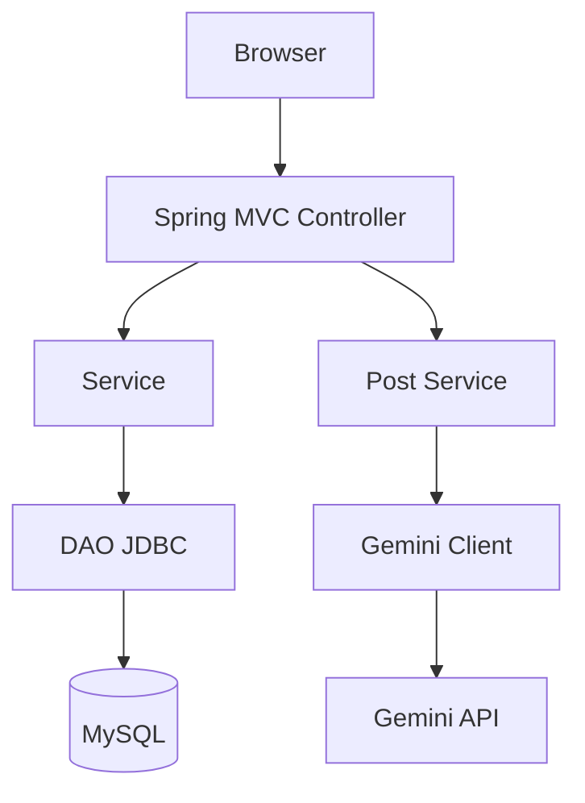

# Architecture Design（アーキテクチャ設計）

<!-- Document Info（文書情報） -->
| Item（項目） | Value（値） |
|---|---|
| Document ID（文書ID） | ARCH-001 |
| Version（バージョン） | 1.1 |
| Status（ステータス） | Approved |
| Created Date（作成日） | 2026-06-21 |
| Last Updated（最終更新日） | 2026-09-12 |
| Owner（管理者） | Takashi Oikawa |
| Related Documents（関連文書） | README.md / 02_REQUIREMENTS_DEFINITION.md / 03_DATA_AND_SECURITY_DESIGN.md / 06_OPERATION_AND_HANDOFF.md |

---

## Table of Contents（目次）

1. [Purpose（目的）](#1-purpose目的)
2. [Scope（対象範囲）](#2-scope対象範囲)
3. [Out of Scope（対象外範囲）](#3-out-of-scope対象外範囲)
4. [Assumptions（前提条件）](#4-assumptions前提条件)
5. [Definition Details（定義内容）](#5-definition-details定義内容)
6. [Open Issues（未決事項）](#6-open-issues未決事項)
7. [Handoff to Detail Design（詳細設計への引き継ぎ）](#7-handoff-to-detail-design詳細設計への引き継ぎ)

---

## 1. Purpose（目的）

本文書は、Phase 1 のシステム構造、技術方針、外部連携を定義し、実装の基準とする。

---

## 2. Scope（対象範囲）

- Servlet から Spring MVC Controller への移行
- 現行 Logic 責務の Service 化
- JDBC DAO と JSP の維持
- Gemini API 連携
- WAR packaging と embedded Tomcat
- Spring 外部設定への秘密情報移設

---

## 3. Out of Scope（対象外範囲）

Phase 1 対象外として次を導入しない。

- Spring Security による認証基盤
- JPA / Hibernate
- Spring Data
- Thymeleaf
- 外部 Tomcat 必須構成
- `/Users/takashioikawa/Dev/ai-config.json` への絶対パス依存

---

## 4. Assumptions（前提条件）

- 現行アプリ正本は `DokoTsubu2/`
- 機能の基準は現行実装事実である
- context path は `/dokoTsubu` とするが、コードへ固定文字列として書かない
- 現行ライブ DB 実体は 2026-09-12 実測で確認済みである。Schema は `dokotsubu`、Tables は `USERS` / `MUTTERS` である
- Phase 1 は現行 DB を維持し、不要な schema migration を行わない

---

## 5. Definition Details（定義内容）

### 5.1 System Architecture Diagram（システム構成図）

```text
Browser
  ↓
Spring MVC Controller
  ↓
Service
  ↓
DAO (JDBC)
  ↓
MySQL

Post Service
  ↓
Gemini Client
  ↓
Gemini API
```



現行 Servlet 対応:

| 現行 Servlet | Phase 1 | URL |
|---|---|---|
| `servlet.Register` | Controller | `/Register` |
| `servlet.Login` | Controller | `/Login` |
| `servlet.Logout` | Controller | `/Logout` |
| `servlet.Main` | Controller | `/Main` |
| `servlet.SearchMutter` | Controller | `/SearchMutter` |
| `servlet.UpdateMutter` | Controller | `/UpdateMutter` |
| `servlet.DeleteMutter` | Controller | `/DeleteMutter` |

現行 `*Logic` の責務は Service へ移す。DAO は JDBC を維持する。

ログイン必須判定は Controller に複製せず、Spring MVC の共通機構で一元化する。

### 5.2 Technology Stack and Rationale（技術スタック・採用理由）

| Type（種別） | Technology（採用技術） | Version（バージョン） | Rationale（採用理由） |
|---|---|---|---|
| Language（言語） | Java | 21 | 現行 `DokoTsubu2` の言語水準を維持する |
| Framework（フレームワーク） | Spring Boot / Spring MVC | 4.1.1 | 確定方針。JSP を維持するため WAR とする |
| Build Tool | Maven | - | Phase 1 のビルド手段 |
| Packaging | WAR | - | JSP を維持する |
| View | JSP | 現行 JSP を移行 | Thymeleaf は対象外 |
| Persistence | JDBC | - | Spring Data / JPA は使用しない |
| Database（DB） | MySQL | 9.6.0（2026-09-12 ローカル実測） | 現行ローカル実体 |
| Runtime | embedded Tomcat（Spring Boot 管理） | 11.0.x | 外部 Tomcat 必須にはしない |
| External API | Gemini API | 初期 model `gemini-2.5-flash-lite` | 現行連携を維持する |
| Other（その他） | BCrypt | - | password hash のみ。Spring Security 認証基盤は導入しない |

### 5.3 Module Structure and Layer Design（モジュール構成・レイヤー設計）

- Presentation: Spring MVC Controller + JSP
- Application: Service（現行 Logic の責務）
- Persistence: DAO（JDBC）
- External: Gemini Client（投稿成功後に Post Service から同期呼び出し）

固定絶対パス JSON 設定は廃止し、Spring external configuration へ移す。

### 5.4 External Integration and API Design（外部システム連携・API設計方針）

| Integration Target / API Name（連携先 / API名） | Method（連携方式） | Purpose / Overview（用途・概要） |
|---|---|---|
| Gemini generateContent | HTTPS REST 同期呼び出し | 投稿成功後の短文コメント。初期 model は `gemini-2.5-flash-lite`。temperature は `1.5`。失敗しても投稿は rollback しない |
| MySQL | JDBC | Schema `dokotsubu` の `USERS` / `MUTTERS` への永続化。Phase 1 で不要な schema migration は行わない |

Gemini API key は環境変数等の Spring 外部設定から取得する。ソースおよび Git 管理ファイルへ実値を書かない。

アプリケーションエンドポイントは [02_REQUIREMENTS_DEFINITION.md](./02_REQUIREMENTS_DEFINITION.md) の API-001〜007 を正とする。公開 REST API は設けない。

### 5.5 Scalability and Fault Tolerance（スケーラビリティ方針・障害対策）

| Aspect（観点） | Design Details（設計内容） |
|---|---|
| Scaling Policy（スケーリング方針） | 本文書では対象外。理由: Phase 1 は現行機能のローカル移行である |
| Redundancy（冗長化） | 本文書では対象外。理由: Phase 1 対象外 |
| Failover（フェイルオーバー） | 本文書では対象外。理由: Phase 1 対象外 |
| Other Fault Tolerance（その他耐障害設計） | Gemini 失敗時も投稿を残し、失敗文を画面へ返す |

### 5.6 Infrastructure and Environment（インフラ・環境構成）

| Environment（環境） | Configuration / Resources（構成・リソース概要） |
|---|---|
| Development（開発） | ローカル executable WAR。embedded Tomcat。context path `/dokoTsubu`。MySQL と Gemini は外部設定。秘密情報がファイル必要な場合のみ `.local-secrets/`（Git 管理外） |
| Staging（ステージング） | 本文書では対象外。理由: Phase 1 対象外 |
| Production（本番） | 本文書では対象外。理由: Phase 1 対象外 |

---

## 6. Open Issues（未決事項）

本文書では対象外。理由: 構成の確定事項は本文に記載済み。

---

## 7. Handoff to Detail Design（詳細設計への引き継ぎ）

- Spring Security / JPA / Spring Data / Thymeleaf を追加しない
- 絶対パスの `ai-config.json` を復活させない
- context path は設定で `/dokoTsubu` とし、Controller / JSP に直書きしない
- temperature の正は `1.5` である。Legacy 文書の `0.7` は持ち込まない
- MySQL は Schema `dokotsubu` の `USERS` / `MUTTERS` を対象とする。Phase 1 で不要な schema migration は行わない
