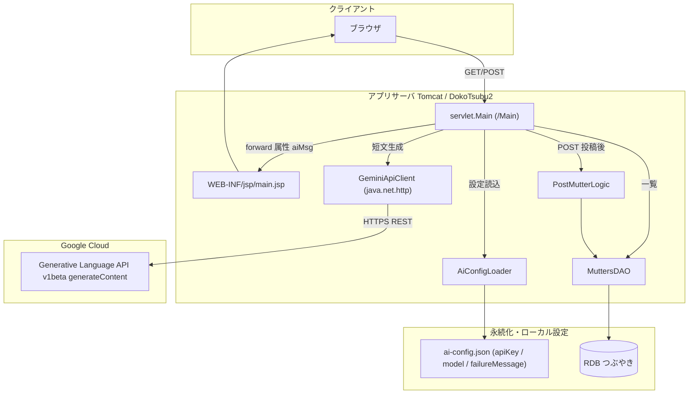
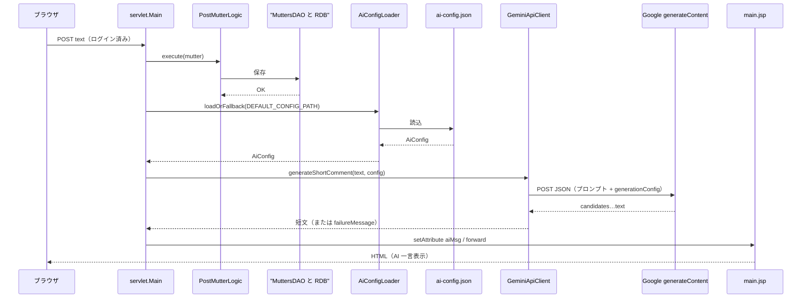

# DokoTsubu2 設計書

**作成日:** 2024-06-15  
**最終更新:** 2026-04-12  
**作成者:** Takashi Oikawa

---

## 1. 目的・範囲

本書は、`dokoTsubu-platform` リポジトリ内の Webアプリ **`DokoTsubu2`** について、**実在するファイル構成**（プロジェクト構成 / パッケージ構成 / モジュール対応 / 配置資材 / 同梱ライブラリ）を整理する。

### 1. Gemini API 連携・表示仕様

- **概要**: `servlet.Main` の投稿（POST）処理内で Gemini API を呼び出し、生成した短文コメントをリクエスト属性 `aiMsg` に格納して `main.jsp` で表示する。
- **関連クラス**: `model.AiConfigLoader` / `model.GeminiApiClient` / `servlet.Main` / `WEB-INF/jsp/main.jsp`
- **詳細**: `docs/AI設定仕様書.md`

### アーキテクチャ図（Gemini API 連携を含む）

以下は **現行実装**（`servlet.Main` → 投稿保存 → 設定読込 → `GeminiApiClient` → Google API → `main.jsp`）を前提とした原案図である。Markdown プレビューで Mermaid が有効な環境では図として表示される。

#### コンポーネント図



#### 投稿時シーケンス（POST / ログイン済み）



---

## 2. プロジェクト構成（リポジトリ構成）

本節は、読み手が **Git 上で参照すべき構成**と、開発環境で生成される **ローカル生成物（Git 管理対象外）**を区別して記載する。

### 2-1. Git 管理対象の主要構成

```
dokoTsubu-platform/
├── DokoTsubu2/                      # 内側アプリ
│   ├── src/                         # アプリ本体ソース
│   │   └── main/
│   │       ├── java/
│   │       └── webapp/
│   ├── docs/                        # DokoTsubu2 配下ドキュメント（障害記録）
│   │   ├── Eclipse2025_DokoTsubu_起動障害_原因対策記録.md
│   │   └── Eclipse2025_DokoTsubu_コンテキスト衝突_原因対策記録.md
│   ├── .gitignore
│   └── dokoTsubuをクローンした際のエラー対策①.txt
├── README.md
└── docs/                            # リポジトリ直下ドキュメント
    ├── 設計書.md                    # 本ファイル
    ├── AI設定仕様書.md
    ├── API仕様書.md
    ├── 環境構築手順書.md
    └── DokoTsubu_修正履歴_20260403.md
```

補足: `DokoTsubu2/` 配下には Eclipse の設定ディレクトリ `DokoTsubu2/.settings/` が存在するが、**WTP 共有設定の一部を含む一方でローカル依存設定は除外**される（どのファイルが除外対象かは `DokoTsubu2/.gitignore` に従う）。

### 2-2. ローカル生成物（参考 / Git 管理対象外）

以下は **作業端末で生成される成果物**であり、`DokoTsubu2/.gitignore` により **Git 管理対象外**として扱われる。

- `DokoTsubu2/build/classes/`（ローカル生成物）
- `DokoTsubu2/build/tools/`（ローカル生成物）

また、Eclipse のローカルメタ情報（例: `DokoTsubu2/.project`, `DokoTsubu2/.classpath`、および一部の `DokoTsubu2/.settings/*`）も `DokoTsubu2/.gitignore` の対象であり、Git 管理対象外として扱われる。

---

## 3. パッケージ構成（`DokoTsubu2` のソース配置）

`DokoTsubu2/src/main/` 配下の実在構成は以下。

```
DokoTsubu2/src/main/java/
├── Memo.java
├── dao/
│   ├── MuttersDAO.java
│   └── UserDAO.java
├── model/
│   ├── AiConfigLoader.java
│   ├── DeleteMutterLogic.java
│   ├── GeminiApiClient.java
│   ├── GetMutterListLogic.java
│   ├── LoginLogic.java
│   ├── Mutter.java
│   ├── PostMutterLogic.java
│   ├── RegisterUserLogic.java
│   ├── SearchMutterLogic.java
│   ├── UpdateMutterLogic.java
│   └── User.java
└── servlet/
    ├── DeleteMutter.java
    ├── Login.java
    ├── Logout.java
    ├── Main.java
    ├── Register.java
    ├── SearchMutter.java
    └── UpdateMutter.java

DokoTsubu2/src/main/webapp/
├── index.jsp
├── css/
│   └── style.css
├── META-INF/
│   └── MANIFEST.MF
└── WEB-INF/
    ├── web.xml
    ├── jsp/
    │   ├── loginResult.jsp
    │   ├── logout.jsp
    │   ├── main.jsp
    │   ├── registerResult.jsp
    │   ├── registerView.jsp
    │   └── updateMutter.jsp
    └── lib/
        ├── gson-2.11.0.jar
        └── mysql-connector-j-9.5.0.jar
```

---

## 4. モジュール構成・役割

### 4-1. Servlet（Controller）

- `servlet/Login.java`: `@WebServlet("/Login")`
- `servlet/Logout.java`: `@WebServlet("/Logout")`
- `servlet/Register.java`: `@WebServlet("/Register")`
- `servlet/SearchMutter.java`: `@WebServlet("/SearchMutter")`
- `servlet/UpdateMutter.java`: `@WebServlet("/UpdateMutter")`
- `servlet/DeleteMutter.java`: `@WebServlet("/DeleteMutter")`
- `servlet/Main.java`: **アノテーション無し**（`WEB-INF/web.xml` で `/Main` に明示マッピング）

### 4-2. Model（Logic / Entity）

- **Entity**
  - `model/User.java`
  - `model/Mutter.java`
- **Logic（ユースケース処理）**
  - `model/LoginLogic.java`
  - `model/RegisterUserLogic.java`
  - `model/GetMutterListLogic.java`
  - `model/PostMutterLogic.java`
  - `model/SearchMutterLogic.java`
  - `model/UpdateMutterLogic.java`
  - `model/DeleteMutterLogic.java`
- **外部連携（AI）**
  - `model/AiConfigLoader.java`（外部JSONの読込）
  - `model/GeminiApiClient.java`（Gemini API 呼び出し）

### 4-3. DAO（DBアクセス）

- `dao/UserDAO.java`: `users` テーブルへ INSERT / SELECT（ログイン照会）
- `dao/MuttersDAO.java`: `MUTTERS` / `USERS` を JOIN した一覧取得、`MUTTERS` の INSERT / UPDATE / DELETE、全文検索（LIKE）

### 4-4. View（JSP）

- `index.jsp`: ログインフォーム入口
- `WEB-INF/jsp/loginResult.jsp`: ログイン結果
- `WEB-INF/jsp/logout.jsp`: ログアウト
- `WEB-INF/jsp/registerView.jsp`: ユーザー登録フォーム
- `WEB-INF/jsp/registerResult.jsp`: ユーザー登録完了
- `WEB-INF/jsp/main.jsp`: つぶやき一覧・投稿
- `WEB-INF/jsp/updateMutter.jsp`: つぶやき編集

---

## 5. JSP / Servlet / Model / DAO 対応表（実ファイル基準）

**凡例**

- **URL**: `@WebServlet(...)` もしくは `WEB-INF/web.xml` の定義
- **forward/redirect**: ソース内に現れる遷移先文字列（実装上の値）

| Servlet | URL | View（forward/redirect 先） | 使用 Model | 使用 DAO |
|---|---|---|---|---|
| `servlet/Login` | `/Login` | `GET`: `.../index.jsp`（redirect） / `POST`: `/WEB-INF/jsp/loginResult.jsp`（forward） | `model/LoginLogic`, `model/User` | `dao/UserDAO`（`LoginLogic` 経由） |
| `servlet/Logout` | `/Logout` | `WEB-INF/jsp/logout.jsp`（forward） | - | - |
| `servlet/Register` | `/Register` | `GET`: `WEB-INF/jsp/registerView.jsp`（forward） / `POST`: `WEB-INF/jsp/registerResult.jsp` または `WEB-INF/jsp/registerView.jsp`（forward） | `model/RegisterUserLogic`, `model/User` | `dao/UserDAO`（`RegisterUserLogic` 経由） |
| `servlet/Main` | `/Main`（`web.xml`） | 未ログイン時: `.../index.jsp`（redirect） / ログイン済み: `/WEB-INF/jsp/main.jsp`（forward） | `model/GetMutterListLogic`, `model/PostMutterLogic`, `model/Mutter`, `model/User`, `model/AiConfigLoader`, `model/GeminiApiClient` | `dao/MuttersDAO`（各Logic経由） |
| `servlet/SearchMutter` | `/SearchMutter` | 未ログイン時: `"/dokoTsubu/"`（redirect） / ログイン済み: `/WEB-INF/jsp/main.jsp`（forward） | `model/SearchMutterLogic`, `model/Mutter`, `model/User` | `dao/MuttersDAO`（`SearchMutterLogic` 経由） |
| `servlet/UpdateMutter` | `/UpdateMutter` | `GET`: `/WEB-INF/jsp/updateMutter.jsp`（forward） / `POST`: `.../Main`（redirect）または `/WEB-INF/jsp/updateMutter.jsp`（forward） | `model/UpdateMutterLogic` | `dao/MuttersDAO`（`UpdateMutterLogic` 経由） |
| `servlet/DeleteMutter` | `/DeleteMutter` | `.../Main`（redirect） | `model/DeleteMutterLogic` | `dao/MuttersDAO`（`DeleteMutterLogic` 経由） |

---

## 6. `web.xml`（サーブレット定義）

`DokoTsubu2/src/main/webapp/WEB-INF/web.xml` では、`/Main` のみを明示定義している（他はアノテーション定義）。

- `servlet-name`: `MainServlet`
- `servlet-class`: `servlet.Main`
- `url-pattern`: `/Main`

---

## 7. 同梱ライブラリ（実在ファイル）

`DokoTsubu2/src/main/webapp/WEB-INF/lib/` に実在する jar は以下。

- `mysql-connector-j-9.5.0.jar`
- `gson-2.11.0.jar`

---

## 8. DB（DAO に現れる接続情報・テーブル前提）

本節は **DAO ソースに記載された文字列**（JDBC URL / テーブル名 / カラム名）をそのまま整理したもの。

### 8-1. JDBC URL（実装上の値）

- `dao/UserDAO.java`: `jdbc:mysql://localhost/dokoTsubu`
- `dao/MuttersDAO.java`: `jdbc:mysql://localhost/dokoTsubu?useAffectedRows=false`

### 8-2. テーブル・カラム（SQL に現れる名称）

- `users`（`id`, `name`, `pass`）
- `MUTTERS`（`ID`, `USER_ID`, `TEXT`）
- `USERS`（`ID`, `NAME`）※ `MuttersDAO` の JOIN で参照

